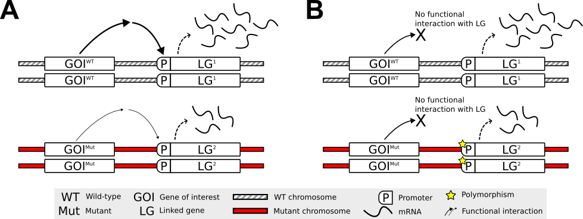
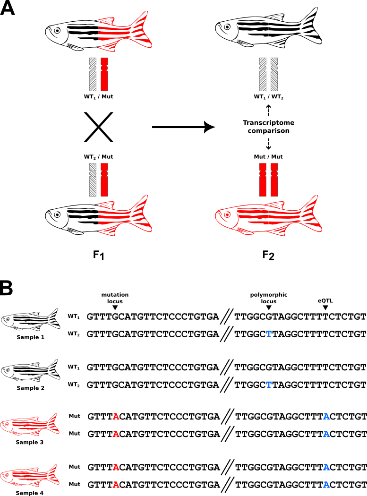

```{r global-opts, include = FALSE}
knitr::opts_chunk$set(
    collapse = TRUE, comment = "#>", message = FALSE, crop = NULL
)
if (!interactive())
    options(width = 999) # Wide chunk output will horizontal scroll instead of wrap
```

# Introduction

## Background

Differential Allelic Representation (DAR) describes a situation commonly encountered in RNA-seq experiments involving organisms that are not isogenic, and where modern techniques such as CRISPR have been used for generation of individual organisms.
DAR comprises the integrity of Differential Expression analysis results as it can bias expression, influencing the classification of genes (or transcripts) as being differentially expressed (DE).
The concern does not lie within the statistical measures for detecting differential expression, because the underlying biology does indeed result in differential expression.
However, without DAR analysis, the impacts of DAR are confounded with the experimental condition of interest and features can be incorrectly inferred as DE in response to the experimental condition, when they are actually an artefact of DAR.
DAR analysis is therefore recommended as a complementary technique alongside Differential Expression analysis where non-isogenic conditions are present.

DAR occurs when the construction of experimental sample groups unexpectedly results in an unequal distribution of polymorphic alleles between the groups.
This is often due to random chance when selecting group composition, however, may also be compounded by a study's experimental design (described further below).
When unequally-represented polymorphic alleles are also expression quantitative trait loci (eQTLs), expression differences between experimental groups are observed similarly to that of a functional response to an experimental condition (Figure&nbsp;\@ref(fig:ase-example)).
Analysis of gene expression in absence of the consideration of DAR is problematic as the source of differential expression will be unclear.

```{r ase-example, echo = FALSE, fig.wide=TRUE, fig.cap = 'Two confounding scenarios that result in differential gene expression between experimental groups when samples are not isogenic. *Experimental grouping is illustrated as mutant vs wild-type control, but is also applicable for other experimental designs (e.g. treatment vs control). The key aspect here is that polymorphic regions of the homologous chromosomes differ between the experimental groups. **A)** Functional differential expression. The experimental factor (genotype of the gene-of-interest, GOI) has a functional interaction with a bystander gene (linked gene, LG), resulting in expression differences between the experimental groups. This is the assumed mechanism when inferring differential expression outcomes. However, a lack of between-group isogenicity complicates this assumption. **B)** eQTL-driven differential expression. A polymorphism in the promoter region of mutant samples, for example, causes expression differences between mutant and wild-type groups in the absence of a functional interaction between GOI and LG. This may incorrectly be inferred as differential expression due to the experimental condition.*'}
if (!interactive())
    
```

The presence of DAR is influenced by the nature of an experiment's design.
In studies that select experimental groups from a common sample pool, for example "treatment vs control" designs, DAR is predominantly driven by the isogenicity within the initial pool and the stochastic selection of samples.
However, in studies involving the selection of groups based on a genetic feature, for example "mutant vs wild-type", the presence of DAR is often intensified on the chromosome(s) containing the determining feature.
This is because the selection criteria also drives selection for alleles linked to the determining feature (Figure&nbsp;\@ref(fig:selection-driven-dar)).

```{r selection-driven-dar, echo = FALSE, fig.wide=TRUE, fig.cap = 'DAR is frequently encountered in studies that involve experimental group selection based on the presence of a genetic feature, and is intensified on the chromosome containing the feature. *This figure illustrates the scenario where experimental sample groups are selected based on the presence of a mutant locus. Zebrafish are used as an example to signify that the model organism is not isogenic. **A)** A common breeding scheme for an intrafamily homozygous mutant vs wild-type transcriptome comparison. As a result of selection across multiple generations for the mutant chromosome (indicated in red), which originates from a single F~0~ fish (not pictured), homozygous mutant F~y~ fish posess two exact copies of the chromosome harbouring the mutation, disregarding recombination. However, wild-type F~y~ fish likely posses two different wild-type chromosomes (shaded using different stripe pattterns to indicate they are not isogenic). **B)** Experimental selection of progeny homozygous for a mutant allele involves increased homozygosity for alleles of genes linked to that mutation (i.e. on the same chromosome). High DAR is observed at the eQTL location, resulting in expression differences between the groups that are unrelated to the impact of the mutation. Moderate DAR is observed at the polymorphic locus, due to one of the wild-type chromosomes posessing the same polymorphism. If this polymorphism was also an eQTL, expression differences would be observed to a lesser extent.*'}
if (!interactive())
    
```

DAR analysis results in an easy-to-interpret value between 0 and 1 for each genetic feature of interest, where 0 represents identical allelic representation and 1 represents complete diversity.
This metric can be used to identify features prone to false-positive calls in Differential Expression analysis, and can be leveraged with statistical methods to alleviate the impact of such artefacts on RNA-seq data.

## Further reading

- The methodologies of this package were developed and described in @baer2023. 
- This phenomenon was flagged as problematic in @white2022.

# Setup

## Installation

`BiocManager` is recommended for the installation of packages required in this vignette.
`BiocManager` handles the installation of packages from both the CRAN and Bioconductor repositories.

```{r install-pkgs, eval=FALSE}
if (!"BiocManager" %in% rownames(installed.packages()))
    install.packages("BiocManager")
pkgs <- c("tidyverse", "limma", "darr")
BiocManager::install(pkgs, update = FALSE)
```

Now we can load the required packages.

```{r load-pkgs}
library(tidyverse)
library(limma)
library(darr)
```

## Data

The example data used in this vignette is provided within the `darr` package.

The `VCF` file `chr1.vcf.bgz` contains multi-sample genotype calls produced from raw RNA-seq `FASTQ` data.
The data originates from zebrafish (*Danio rerio*) brain transcriptomes, and further information can be found in the associated manuscript by @gerken2023.
The `VCF` has been modified to remove headers and other data that are not essential for example purposes, and has been subset to a single chromosome (Chromosome 1).

The `GRanges` object `chr1_genes` contains gene feature information from the Ensembl database (release version 101) for *Danio rerio* Chromosome 1 (@cunningham2022).

```{r load-data}
vcf <- system.file("extdata", "chr1.vcf.bgz", package = "darr")
data("chr1_genes")
```

# DAR analysis

DAR analysis is performed by incorporating single nucleotide-level genotype calls from variant calling software.
We recommend the GATK best practices workflow for [RNAseq short variant discovery (SNPs + Indels)](https://gatk.broadinstitute.org/hc/en-us/articles/360035531192-RNAseq-short-variant-discovery-SNPs-Indels-) as a reference for the generation of data required to begin DAR analysis.
However, should individual genomes be also available for the experimental samples, these can add significant important information.
Ultimately, we require a multi-sample `VCF` file with each entry representing the genomic location of a single nucleotide polymorphism (SNP) that differs from the reference genome in at least one sample.

The functions contained in this package are intended to be implemented as a sequential workflow, with each function addressing a discrete step in the data processing/analysis procedure.
Please follow the steps in order as outlined below.

## Loading genotype data

Genotype data from a `VCF` file is parsed into a `GRanges` object using the `readGenotypes()` function.
This function is essentially a wrapper to `VariantAnnotation::readVcf()`, but only loads the data required for DAR analysis.
By default, phasing information is removed as it is not required for DAR analysis and complicates downstream processing.
This simply converts genotype calls represented as, for example `0|1` to `0/1`, and is required if proceeding with the DAR analysis workflow.
This can optionally be turned off with the `unphase` argument if this function is intended to be used for alternative purposes.
The `genome` option is also available to override the genome automatically detected from the `VCF`.
We intend to work with multiple `GRanges` objects and keeping the genome consistent avoids downstream errors.
Additional arguments will be passed directly to `VariantAnnotation::readVcf()`.

```{r readGenotypes}
genotypes <- readGenotypes(file = vcf)
```

```{r head-genotypes, echo=FALSE}
head(genotypes)
```

Genotypes are reported as numeric indices.
`0` indicates the reference allele, `1` is the first alternate allele, `2` is the second alternate allele, and `3` is the third alternate allele.
Even though we are working with a diploid organism, four alleles are theoretically possible as the VCF consists of multiple samples.
Genotypes that could not be determined by the variant calling software are reported as `./.`.
We work directly with the indices as they are consistent across all samples for a single variant position.

## Counting alleles

We aim to calculate a DAR value at each suitable variant locus.
This requires us to firstly summarise the genotype data into counts of the alleles reported at each variant locus.
First we define our sample grouping structure as a `list`, where each element contains a character vector of samples within a single group.

```{r groups}
groups <- list(
    group1 = paste0("sample", 1:6),
    group2 = paste0("sample", 7:13)
)
```

Now at each locus we can count the number of alleles that exist within each group with `countAlleles()`.
This returns a `GRangesList` with each element corresponding to a different sample group.
Columns indicate how many samples had called alleles, how many were missing and the counts of reference allele, followed by alternate alleles `n_1`, `n_2` and `n_3` ensuring multi-allelic sites are retained

```{r countAlleles}
counts <- countAlleles(genotypes = genotypes, groups = groups)
```

```{r head-counts, echo=FALSE}
head(counts)
```

## Removing undesired loci

Not all samples were assigned genotypes during the variant calling procedure.
Loci with a large number of assigned genotypes across all samples possess information that can be used to more accurately determine differences in allelic representation between experimental groups.
We can remove the less informative data by filtering variant loci independently within each sample group with the `filterLoci()` function.
The `filter` argument controls the criterion for selection of loci that we want to keep, by providing a logical expression using the metadata column names of our `counts` object (i.e. `n_called`, `n_missing`, `n_0`, `n_1`, `n_2` and `n_3`).
By default, `filterLoci()` keeps loci that satisfy the criterion: number of samples with called genotypes > number of samples with missing genotypes.

```{r counts_filt}
counts_filt <- filterLoci(counts = counts)
```

```{r head-counts_filt, echo=FALSE}
head(counts_filt)
```

Specifying a filter with high stringency will result in greater removal of loci, but more accurate downstream results.
For example, we can remove all loci where at least one sample does not possess a genotype call, resulting in complete information of allelic representation in each sample group.

```{r counts_filt_2}
counts_filt_2 <- filterLoci(counts = counts, filter = n_missing == 0)
```

```{r head-counts_filt_2, echo=FALSE}
head(counts_filt_2)
```

Note that because the filter is applied within each experimental sample group, we now have loci that are present in one group but not the other.
This allows greater flexibility for more complex experimental designs that involve multiple comparisons between a greater number of sample groups than provided in this example.
Ultimately, comparisons of allelic representation will be performed only on the intersection of loci present in each sample group.

## Normalisation of allele counts

Depending on the stringency of the previously applied filter, it's still possible that not every sample will have a genotype call.
One experimental group may also contain more samples than another, which is the case in this example, where group1 contains `r length(groups$group1)` samples and group2 contains `r length(groups$group2)` samples.
We account for this by normalising the allele counts as a proportion of total counts at each locus.

```{r countsToProps}
props <- countsToProps(counts = counts_filt)
```

```{r head-props, echo=FALSE}
head(props)
```

## Calculating DAR

Now that we have normalised values of allelic representation at each variant locus within our sample groups, we can calculate the DAR metric between our experimental groups.
We require at least two sample groups to proceed with DAR analysis, however we can set up more comparisons depending on how many groups are present.
We define these comparisons as a contrast `matrix`.

```{r contrasts}
contrasts <- matrix(
    data = c(1, -1),
    dimnames = list(
        Levels = c("group1", "group2"),
        Contrasts = c("group1v2")
    )
)
```

Alternatively, this can be simplified with the `makeContrasts()` function from the `limma` package (@ritchie2015).

```{r makeContrasts}
contrasts <- makeContrasts(
    group1v2 = group1 - group2,
    levels = names(groups)
)
```

DAR is calculated by firstly determining the Euclidean distance between allelic proportions of the contrasted sample groups.
The Euclidean distance is then converted to the DAR metric by dividing by the maximum possible distance, $\sqrt{2}$, resulting in an easy-to-interpret value between 0 and 1, where 0 represents identical allelic representation and 1 represents complete diversity.
This is handled within the `dar()` function by passing our allelic proportions and intended contrasts as arguments.

Two types of DAR values are reported by the `dar()` function as metadata columns of the resulting `GRanges` objects:

- `dar_origin`: The raw DAR values calculated at single nucleotide positions (the origin) between sample groups.
These values represent DAR estimates at a precise locus.
- `dar_region`: The mean of raw DAR values in a specified region surrounding the origin.
This is optionally returned using either of the `region_fixed` or `region_loci` arguments, which control the strategy and size for establishing regions (more information below).
This option exists because eQTLs don't necessarily confer their effects on genes in close proximity.
Therefore, DAR estimates that are representative of regions may be more suitable for downstream assignment DAR values to genomic features.

`region_fixed` and `region_loci` are optional arguments that offer users `dar_region` values in conjunction with `dar_origin` values.
While only one of these two arguments is required, if both are provided, `region_fixed` takes precedence.
Understanding the distinctions in how each option defines regions around an origin is important, as their selection carries subjective implications downstream.

- `region_fixed`: Establishes a region with a fixed size around the origin.
The total region size is defined in base pairs, meaning that the region will extend `region_fixed / 2` base pairs either side of the origin.
For example if `region_fixed = 101` is specified, an origin at position 500 will have an associated region spanning positions 450-550.
- `region_loci`: Establishes an elastic region to average the specified number of loci with `dar_origin` values, such that this number of values are included.
Note that whilst the number of points around the central value may be equal, the genomic distances may not be.
In contrast to `region_fixed`, `region_loci` results in DAR estimates that cover a substantial proportion of each chromosome (i.e from the first locus to the last), which is useful for downstream assignment of DAR values to a greater number of genomic features.

The remainder of this vignette uses examples produced from specifying the `region_loci` argument.

```{r region_loci}
region_loci <- 5
```

With a chosen elastic region size of `r region_loci` loci, this will smooth the DAR metric at each origin locus with the DAR values of the `r (region_loci - 1) / 2` loci either side.

```{r dar}
dar <- dar(props = props, contrasts = contrasts, region_loci = region_loci)
```

```{r head-dar, echo=FALSE}
head(dar)
```

We now have DAR values for loci shared between the two sample groups of the defined contrasts.
Each element of the resulting `GRangesList` object represents a single contrast and are named as defined in our `contrasts` object.

## Assigning DAR values to features

The final step of DAR analysis involves assigning DAR values to features of interest.
It makes sense to select features that were tested for differential expression, because this step provides an estimate of the potential for eQTL impacts on a feature's expression.
This is performed with the `assignFeatureDar()` function, passing the features of interest as a `GRanges` object.
In this example we use the genes contained in `chr1_genes`, which was loaded earlier.

The `dar_val` argument controls whether origin or region DAR values are used when assigned to features.
In the code below we specify `dar_val = "origin"`, as the ranges of our `GRanges` objects held in `dar` currently represent those associated with origin DAR values (read further to see the alternative scenario).
The `fill_missing` argument controls what value is assigned to features with no overlaps.
This defaults to `NA` for easy filtering of features with unassigned DAR values.

For each feature, `assignFeatureDar()` takes the mean of DAR values for any associated ranges that overlap the feature range.
With the following configuration, it means the resulting assigned DAR values represent the average DAR that exists solely within the feature.

```{r assignFeatureDar-origin}
gene_dar <- assignFeatureDar(
    dar = dar,
    features = chr1_genes,
    dar_val = "origin",
    fill_missing = NA
)
```

```{r head-assignFeatureDar-origin, echo=FALSE}
head(gene_dar)
```

Whilst eQTLs don't necessarily exist within a feature itself, smoothed values within a feature may still be representative of the surrounding region as inheritied haplotypes. 
Additionally, we can opt to use the region DAR values (`dar_region` metadata column in the `dar` object) to assign DAR from the regions surrounding a feature to increase the amount of smoothing.
The size of this region is controlled with the `region_loci` argument in the `dar()` function, which we previously set as `r region_loci`.

To assign DAR values based on regions, we must firstly utilise the `flipRanges()` function.
We can also specify the `extend_edges` option to extend the outermost ranges of each chromosome to encompass the entire chromosome.
This is useful for ensuring the assignment of DAR values to all features. 
However, caution should be taken with features that exist toward the edges of a chromosome as any assigned DAR values may be less accurate.

```{r flipRanges}
dar_regions <- flipRanges(dar = dar, extend_edges = TRUE)
```

```{r head-dar_regions, echo=FALSE}
head(dar_regions)
```

`flipRanges()` can also be used to revert back to ranges that represent the origins.

```{r flipRanges-revert}
identical(dar, flipRanges(dar_regions))
```

Now we can assign DAR values to features based on their surrounding region, by supplying our new ranges and selecting `dar_val = region`.
A warning will be produced if the ranges don't match the selected `dar_val`, as this is likely unintended by the user.
However, use cases may exist and the warning can be ignored if this is intended.

```{r assignFeatureDar-region}
gene_dar_regions <- assignFeatureDar(
    dar = dar_regions,
    features = chr1_genes,
    dar_val = "region"
)
```

```{r head-gene-dar-regions, echo=FALSE}
head(gene_dar_regions)
```

Note that because elastic regions were defined, and `extend_edges` was set to `TRUE`, all genes in `chr1_genes` now have an assigned DAR value.

## DAR analysis using the pipe operator

The functions in this package have been designed to enable DAR analysis with minimal effort.
The steps above can be performed in several lines of code as follows.

First load the required packages.

```{r load-pkgs-pipe, eval=FALSE}
library(tidyverse)
library(limma)
library(darr)
```

Then define the input objects.

```{r objects-pipe, eval=FALSE}
vcf <- system.file("extdata", "chr1.vcf.bgz", package="darr")
data("chr1_genes")
groups <- list(
    group1 = paste0("sample", 1:6),
    group2 = paste0("sample", 7:13)
)
contrasts <- makeContrasts(
    group1v2 = group1 - group2,
    levels = names(groups)
)
region_loci <- 5
```

Now use the `base` pipe to assign DAR values to genes based on their surrounding region.

```{r base-pipe, eval=FALSE}
gene_dar <- readGenotypes(vcf) |>
    countAlleles(groups = groups) |>
    filterLoci() |>
    countsToProps() |>
    dar(contrasts = contrasts, region_loci = region_loci) |>
    flipRanges(extend_edges = TRUE) |>
    assignFeatureDar(features = chr1_genes, dar_val = "region")
```

# Visualisation

## The trend in DAR along a chromosome

The `plotChrDar()` function produces a localised visualisation of the trend in DAR along a chromosomal axis with the option to overlay the positions of features of interest.
This allows us to compare DAR between regions and/or chromosomes, and visually assess if features may be prone eQTL artefacts.
`plotChrDar()` is a convenience function that returns a `GViz` plot consisting of an optional number of tracks.
To produce a minimal plot, this function requires the `dar` argument, expecting a `GRanges` object with DAR values in the metadata columns, and the `dar_val` argument as a character string to select the appropriate DAR values from either the `dar_origin` or `dar_region` metadata columns.
These arguments form the `DataTrack` displaying the trend in DAR.
Features of interest (e.g. a mutation locus) can be passed to the `foi` argument as a `GRanges` object and will be plotted along the `GenomeAxisTrack`.
Additional features (e.g. DE genes) can similarly be passed to the `features` argument to be plotted as a separate `AnnotationTrack`.
The `*_anno` and `*_highlight` arguments are used to select the metadata column containing feature labels, and to choose if their positions should be highlighted over the `DataTrack` displaying the trend in DAR respectively.
We can also add a title with the `title`  argument.
`GViz` requires that any `GRanges` objects consist of ranges on a single chromosome, however these can be internally subset using the `chr` argument (which will also control the title of the `GenomeAxisTrack`).

```{r plotChrDar, fig.wide=TRUE}
set.seed(230822)
foi <- sample(chr1_genes, 1)
features <- sample(chr1_genes, 20)
plotChrDar(
    dar = dar$group1v2, dar_val = "region", chr = "1",
    foi = foi, foi_anno = "gene_name", foi_highlight = TRUE,
    features = features, features_anno = "gene_name", features_highlight = TRUE,
    title = "Example plot of DAR along Chromosome 1"
)
```

## Comparing DAR between chromosomes

It may be of use to quickly assess whether a particular chromosome is affected by high DAR more so than other chromosomes.
This is particularly relevant when a study's experimental design causes increased DAR on a particular chromosome.
The `plotDarECDF()` function facilitates this purpose by plotting the Empirical Cumulative Distribution Function (ECDF) of DAR for each chromosome.
This function returns a `ggplot2` object, allowing us to add our own styling.
For this example we use simulated data that results in a visualisation commonly observed when experimental sample groups have been constructed based on the presence/absence of a genetic feature of interest (e.g. a mutant locus).

```{r plotDarECDF}
set.seed(230704)
simulate_dar <- function(n, mean) {
    vapply(
        rnorm(n = n, mean = mean),
        function(x) exp(x) / (1 + exp(x)),
        numeric(1)
    )
}
gr <- GRanges(
    paste0(rep(seq(1,25), each = 100), ":", seq(1,100)),
    dar_origin = c(simulate_dar(2400, -2), simulate_dar(100, 0.5))
)
plotDarECDF(dar = gr, dar_val = "origin") +
    theme_bw()
```

We can also choose to highlight the chromosome of interest with the `highlight` argument.

```{r plotDarECDF_highlight}
plotDarECDF(dar = gr, dar_val = "origin", highlight = "25") +
    scale_colour_manual(values = c("TRUE" = "red", "FALSE" = "grey")) +
    theme_bw()
```

# Bibliography

<div id="refs"></div>

# Session information

```{r sessionInfo, echo=FALSE}
options(width = 80) # Revert to default to allow this output to wrap
sessionInfo()
```
