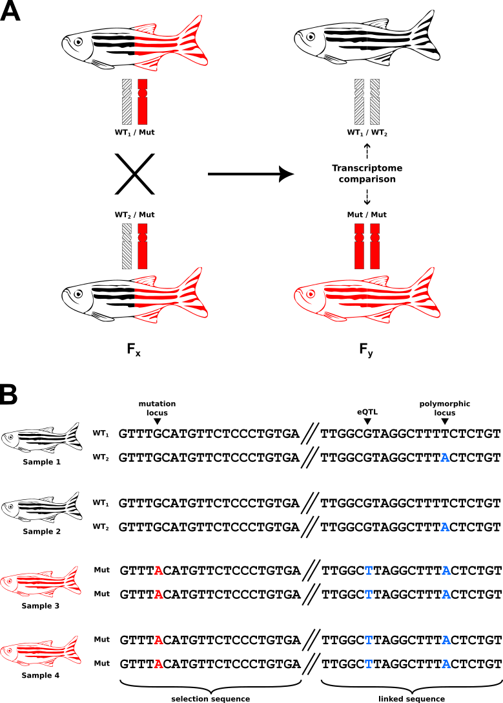

```{r chunk-opts, include = FALSE}
knitr::opts_chunk$set(collapse = TRUE, comment = "#>", message = FALSE)
```

# Introduction

## Background

Differential Allelic Representation (DAR) describes a situation commonly encountered in RNA-seq experiments involving organisms that are not isogenic.
DAR comprises the integrity of Differential Expression analysis results, as it influences the classification of features (e.g. genes) as being differentially expressed (DE).
The concern does not lie within the statistical measures for detecting differential expression, because the underlying biology of the problematic features does indeed result in differential expression.
However, without DAR analysis, the impacts of DAR are confounded with the experimental condition of interest and features can be incorrectly inferred as DE when they are actually an artefact of DAR.
DAR analysis is therefore recommended as a complementary technique alongside Differential Expression analysis.

DAR occurs when the construction of experimental sample groups unexpectedly results in an unequal distribution of polymorphic alleles between the groups.
This is often due to random chance when selecting group composition, however, may also be compounded by a study's experimental design (described further below).
When unequally-represented polymorphic alleles are also expression quantitative trait loci (eQTLs), expression differences between experimental groups are observed similarly to that of a functional response to an experimental condition (Figure&nbsp;\@ref(fig:ase-example)).
Analysis of gene expression in absence of the consideration of DAR is problematic as the source of differential expression is not clear.

```{r ase-example, echo = FALSE, fig.cap = 'Two confounding scenarios that result in differential gene expression between experimental groups when samples are not isogenic. *Experimental grouping is illustrated as mutant vs wild-type control (where this situation is often amplified through group selection based on genotype at a single locus), but is also applicable for other experimental designs (e.g. treatment vs control). The key aspect here is that polymorphic regions of the homologous chromosomes differ between the experimental groups. **A)** Functional differential expression. The experimental factor (genotype of the gene-of-interest, GOI) has a functional interaction with a bystander gene (LG), resulting in expression differences between the experimental groups. This is the assumed mechanism when inferring differential expression outcomes. However, a lack of between-group isogenicity complicates this assumption. **B)** eQTL-driven differential expression. A polymorphism in the promoter region of mutant samples, for example, causes expression differences between mutant and wild-type groups in the absence of a functional interaction between GOI and LG. This may incorrectly be inferred as differential expression due to the experimental condition.*'}
if (!interactive())
  
```

The presence of DAR is influenced by the nature of an experiment's design.
In studies that select experimental groups from a common sample pool, for example "treatment vs control" designs, DAR is predominantly driven by the isogenicity within the initial pool and the stochastic selection of samples.
However, in studies involving the selection of groups based on a genetic feature, for example "mutant vs wild-type", the presence of DAR is often intensified on the chromosome(s) containing the determining feature.
This is because the selection criteria also drives selection for alleles linked to the determining feature (Figure&nbsp;\@ref(fig:selection-driven-dar)).

```{r selection-driven-dar, echo = FALSE, fig.cap = 'DAR is frequently encountered in studies that involve experimental group selection based on the presence of a genetic feature. *Explanation. **A)** Description. **B)** Description.*'}
if (!interactive())
  
```

DAR analysis results in an easy-to-interpret value between 0 and 1 for each genetic feature of interest, where 0 represents identical allelic representation and 1 represents complete diversity. This metric can be used to identify features prone to false-positive calls in Differential Expression analysis, and can be leveraged with statistical methods to alleviate the impact of such artefacts on RNA-seq data.

## Further reading

The methodologies of this package were developed and described in [Baer et al. 2023](https://www.biorxiv.org/content/10.1101/2023.03.02.530865v3). 

This phenomenon was flagged as problematic in [White et al. 2022](https://elifesciences.org/articles/72825).

# Setup

## Installation

`BiocManager` is recommended for the installation of packages required for this vignette.
`BiocManager` handles the installation of packages from both the CRAN and Bioconductor repositories.

```{r install-pkgs, eval=FALSE}
if (!"BiocManager" %in% rownames(installed.packages()))
  install.packages("BiocManager")
pkgs <- c("tidyverse", "darr", "limma")
BiocManager::install(pkgs, update = FALSE)
```

Now we can load the required packages.

```{r load-pkgs}
library(tidyverse)
library(limma)
library(darr)
```

## Data

The example data used in this vignette is contained within the `darr` package.

The `VCF` file `chr1.vcf.bgz` contains multi-sample genotype calls produced from raw RNA-seq `FASTQ` data.
The data originates from zebrafish (*Danio rerio*) brain transcriptomes, and further information can be found in the associated [manuscript](Zebrafish models of Mucopolysaccharidosis types IIIA, B, & C show hyperactivity and changes in oligodendrocyte state) (Gerken et al. 2023).
The `VCF` has been modified to remove headers and information that are not required for example purposes, and has been subset to a single chromosome (Chromosome 1).

The `GRanges` object `chr1_genes` contains gene feature information from the Ensembl release 101 database <ref> for *Danio rerio* Chromosome 1.

```{r load-data}
vcf <- system.file("extdata", "chr1.vcf.bgz", package="darr")
data("chr1_genes")
```

# DAR analysis

DAR analysis is performed on single nucleotide-level genotype calls from variant calling software.
We recommend the GATK best practices workflow for [RNAseq short variant discovery (SNPs + Indels)](https://gatk.broadinstitute.org/hc/en-us/articles/360035531192-RNAseq-short-variant-discovery-SNPs-Indels-) as a reference for the generation of data required to begin DAR analysis.
Ultimately, we require a multi-sample `VCF` file with each entry representing the genomic location of a single nucleotide polymorphism (SNP) that differs from the reference genome in at least one sample.

The functions contained in this package are intended to be implemented as a sequential workflow, with each function addressing a discrete step in the analysis/processing procedure.
Please follow the the steps in order as outlined by this vignette.
For example purposes we will use the `VCF` file loaded above.

## Loading genotype data

Genotype data from the `VCF` file is parsed into a `GRanges` class object using the `readGenotypes()` function.
This function is essentially a wrapper to `VariantAnnotation::readVcf()`, but only loads the data required for DAR analysis.
By default, phasing information is removed as it is not required for DAR analysis and complicates downstream processing.
This simply converts genotype calls represented as (for example) `0|1` to `0/1`, and is required if proceeding with the DAR analysis workflow.
This can optionally be turned off with the `unphase` argument if this function is intended to be used for alternative purposes.
The `genome` option is also available to override the genome automatically detected from the `VCF`.
We intend to work with multiple `GRanges` objects and keeping the genome consistent avoids downstream errors.

```{r readGenotypes}
genotypes <- readGenotypes(file = vcf)
```

```{r head-genotypes, echo=FALSE}
head(genotypes)
```

Genotypes are reported as numeric indices.
`0` indicates the reference allele, `1` is the first alternate allele, `2` is the second alternate allele, and so on.
Genotypes that could not be determined by the variant calling software are reported as `./.`.
We work directly with the indices as they are consistent across all samples for a single variant position.

## Counting alleles

We aim to calculate a DAR value at each suitable variant locus.
This requires us to firstly summarise the genotype data into counts of the alleles reported at each variant locus.
First we define our sample grouping structure as a `list`, where each element contains a character vector of samples within a single group.

```{r groups}
groups <- list(
  group1 = c("S2", "S7", "S9", "S10", "S19", "S20"),
  group2 = c("S3", "S6", "S11", "S12", "S15", "S16", "S18")
)
```

Now at each locus we can count the number of alleles that exist within each group with `countAlleles()`.
This returns a `GRangesList` with each element corresponding to a different sample group.

```{r countAlleles}
counts <- countAlleles(genotypes = genotypes, groups = groups)
```

```{r head-counts, echo=FALSE}
head(endoapply(counts, `[`, , 1:4))
```

## Normalisation of allele counts

Not all samples have genotype calls, so we normalise by converting the allele counts into a proportion of total counts at each locus.
We also filter variant loci independently within each sample group with the default criterion: number of samples with called genotypes > number of samples with missing genotypes.
If users intend to use their own filtering criteria, this can be achieved by setting the `filter` option to false, and using the `filterLoci()` function prior to applying `countsToProps()`.

```{r countsToProps}
props <- countsToProps(counts = counts)
```

```{r head-props, echo=FALSE}
head(endoapply(props, `[`, , 1:2))
```

## Calculating DAR

Now that we have normalised values of allelic representation at each variant locus within our sample groups, we can calculate the DAR metric between our experimental groups.
We require at least two sample groups to proceed with DAR analysis, however we can set up more comparisons depending on how many groups are present.
We define these comparisons as a contrast `matrix`.

```{r contrasts}
contrasts <- matrix(
  data = c(1, -1),
  dimnames = list(
    Levels = c("group1", "group2"),
    Contrasts = c("group1v2")
  )
)
```

Alternatively, this can be simplified with the `makeContrasts()` function from the `limma` package. <ref>

```{r makeContrasts}
contrasts <- makeContrasts(
  group1v2 = group1 - group2,
  levels = names(groups)
)
```

DAR is calculated by firstly determining the Euclidean distance between allelic proportions of the contrasted sample groups.
The Euclidean distance is then converted to the DAR metric by dividing by the maximum possible distance, $\sqrt{2}$, resulting in an easy-to-interpret value between 0 and 1, where 0 represents identical allelic representation and 1 represents complete diversity.
This is handled within the `dar()` function by passing our allelic proportions and intended contrasts as arguments.

Two types of DAR values are reported by the `dar()` function as metadata columns of the resulting `GRanges` objects:

- `dar_origin`: The raw DAR values calculated at single nucleotide positions (the origin) between sample groups.
This represents a DAR estimate at a precise locus.
- `dar_region`: The mean of raw DAR values in a region surrounding the origin. 
The size of the region is controlled using the `winSize` argument, which establishes an elastic sliding window to average the specified number of dar_origin values.
This represents a DAR estimate for the genomic region surrounding the origin locus.

The default `winSize` is 5, however its choice is arbitrary.
We utilise the `dar_region` values as DAR estimates spanning across the genome.
This is primarily useful for assigning DAR values to genome features that do not contain a variant locus.
If this is not intended, `dar_region` values are not essential and can be ignored.

```{r winSize}
winSize <- 5
```

With a chosen elastic window size of `r winSize` loci, this will smooth the DAR metric at each origin locus with the DAR values of the `r (winSize - 1) / 2` loci either side.

```{r dar}
dar <- dar(props = props, contrasts = contrasts, winSize = winSize)
```

```{r head-dar, echo=FALSE}
head(dar)
```

We now have DAR values for loci shared between the two sample groups of the defined contrasts.
Each element of the resulting `GRangesList` object represents a single contrast and are named as defined in our `contrasts` object.

## Assigning DAR values to features

The final step of DAR analysis involves assigning DAR values to features of interest.
It makes sense to select features that were tested for differential expression, because this step provides us with an estimate of the potential for eQTL impacts on a feature's expression.
This is performed with the `assignFeatureDar()` function, passing the features of interest as a `GRanges` object.
In this example we use the genes contained in `chr1_genes`, which was loaded earlier.

The `darVal` argument controls whether origin or region DAR values are used when assigned to features.
In the code below we specify `darVal = "origin"`, as the ranges of our `GRanges` objects held in `dar` currently represent those associated with origin DAR values (read further to see an alternative scenario).
For each feature, `assignFeatureDar()` takes the mean of DAR values for any associated ranges that overlap the feature range.
With this configuration, it means the resulting assigned DAR values represent the average DAR that exists solely within the feature.

```{r assignFeatureDar-origin}
geneDar <- assignFeatureDar(
  dar = dar,
  features = chr1_genes,
  darVal = "origin"
)
```

```{r head-assignFeatureDar-origin, echo=FALSE}
head(geneDar)
```

However, eQTLs don't necessarily exist within a feature itself, so we can opt to use the region DAR values (`dar_region` metadata column in the `dar` object) to assign DAR from the regions surrounding a feature.
The extent of this region is controlled with the `winSize` argument in the `dar()` function, which we previously set as `r winSize`.
To assign DAR values based on regions, we must firstly utilise the `flipRanges()` function.
We can also specify set the `extendEdges` option to extend the outermost ranges of each chromosome to encompass the entire chromosome.
This is useful for ensuring the assignment of DAR values to all features. 
However, precaution must now be taken with the features that exist towards the edges of a chromosome as the assigned DAR may be less accurate.

```{r flipRanges}
dar_regions <- flipRanges(dar = dar, extendEdges = TRUE)
```

```{r head-dar_regions, echo=FALSE}
head(dar_regions)
```

`flipRanges()` can also be used to revert back to ranges that represent the origins.

```{r flipRanges-revert}
identical(dar, flipRanges(dar_regions))
```

Now we can assign DAR values to features based on their surrounding region, by supplying our new ranges and selecting `darVal = region`.
A warning will be produced if the ranges don't match the selected `darVal`, as this is likely unintended by the user.
However, use cases may exist and can be ignored if this is intended.

```{r assignFeatureDar-region}
geneDar_regions <- assignFeatureDar(
  dar = dar_regions,
  features = chr1_genes,
  darVal = "region"
)
```

```{r head-geneDar_regions, echo=FALSE}
head(geneDar_regions)
```

Note that because regions were defined with a sliding window approach, and `extendEdges` was set to `TRUE`, all genes in `chr1_genes` now have an assigned DAR value.

```{r all-genes-assigned-dar}
length(chr1_genes) == length(geneDar_regions$group1v2)
```

## DAR analysis using the pipe operator

The functions in this package have been designed to enable DAR analysis with minimal effort.
The steps above can be performed in several lines of code as follows.

Firstly load the required packages.

```{r load-pkgs-pipe}
library(tidyverse)
library(limma)
library(darr)
```

Then define the input objects.

```{r objects-pipe}
vcf <- system.file("extdata", "chr1.vcf.bgz", package="darr")
data("chr1_genes")
groups <- list(
  group1 = c("S2", "S7", "S9", "S10", "S19", "S20"),
  group2 = c("S3", "S6", "S11", "S12", "S15", "S16", "S18")
)
contrasts <- makeContrasts(
  group1v2 = group1 - group2,
  levels = names(groups)
)
winSize <- 5
```

Now use the `magrittr` pipe to assign DAR values to genes based on their surrounding region.

```{r magrittr-pipe}
geneDar <- readGenotypes(vcf) %>%
  countAlleles(groups = groups) %>%
  countsToProps() %>%
  dar(contrasts = contrasts, winSize = winSize) %>%
  flipRanges(extendEdges = TRUE) %>%
  assignFeatureDar(features = chr1_genes, darVal = "region")
```

Or we can use the `base` pipe to achieve the same result.

```{r base-pipe}
geneDar <- readGenotypes(vcf) |>
  countAlleles(groups = groups) |>
  countsToProps() |>
  dar(contrasts = contrasts, winSize = winSize) |>
  flipRanges(extendEdges = TRUE) |>
  assignFeatureDar(features = chr1_genes, darVal = "region")
```

# Visualisation


# Bibliography


# Session information

```{r sessionInfo}
sessionInfo()
```
